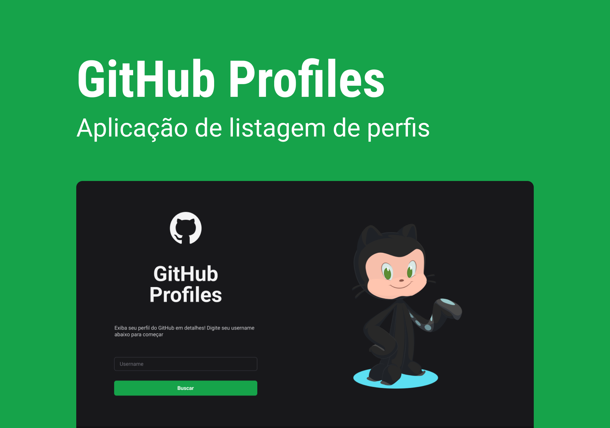
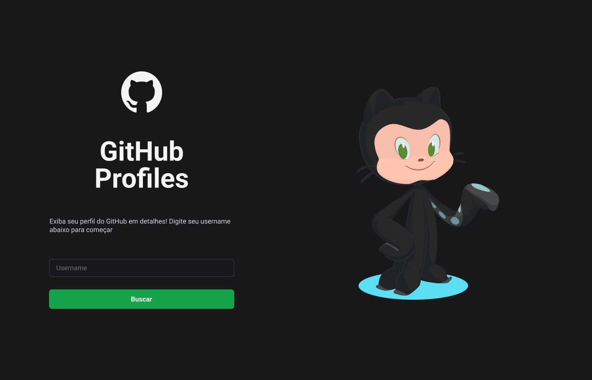
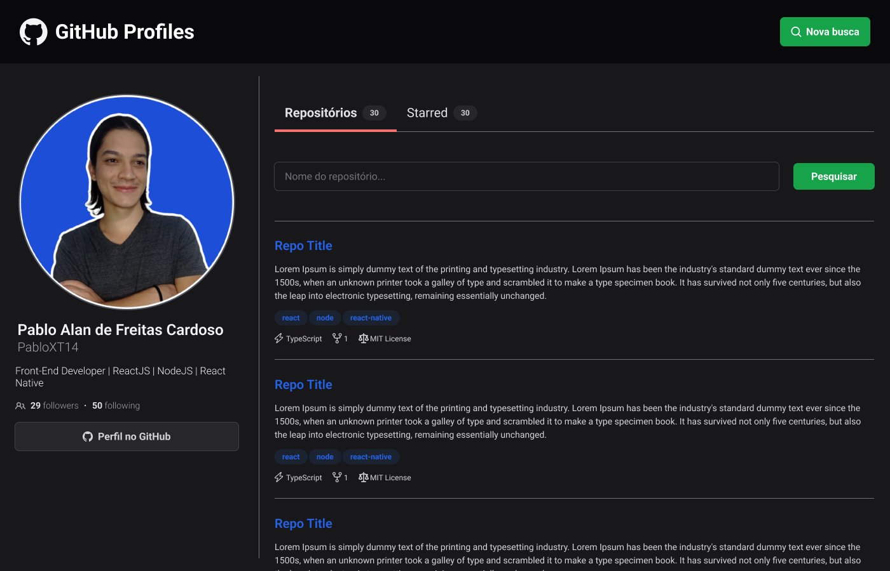
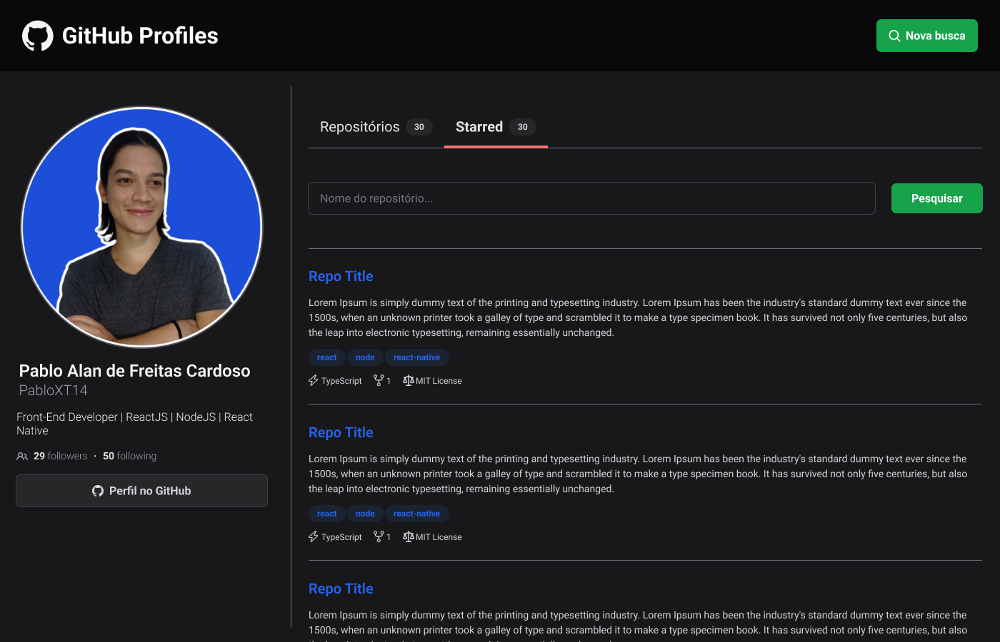

<h1 align="center">
  
  GitHub Profiles
</h1>

<p align="center">
  

  

  
  
  <a href="https://github.com/pabloxt14/github-profiles/commits/master">
    
  </a>
    
   

   <a href="https://github.com/pabloxt14/github-profiles/stargazers">
    
  </a>
</p>

<p>
  
</p>

<h4 align="center"> 
	🚧 Aplicação em desenvolvimento 🚧
</h4>

<p align="center">
 <a href="#-about">About</a> |
 <a href="#-deploy">Deploy</a> |
 <a href="#-layout">Layout</a> | 
 <a href="#-how-it-works">How It Works</a> | 
 <a href="#-technologies">Technologies</a> | 
 <a href="#-author">Author</a> | 
 <a href="#-license">License</a>
</p>


## 💻 About

O projeto **GitHub Profiles** consiste em uma aplicação que mostra os principais detalhes do perfil de um usuário do GitHub, além de também listar os principais repositórios (pessoas e favoritados) deste mesmo usuário.

---

## 🔗 Deploy

O deploy da aplicação pode ser acessada através da seguinte URL base: https://pabloxt14-github-profiles.netlify.app/

---

## 🎨 Layout

Você pode visualizar o layout do projeto através [desse link](https://www.figma.com/file/2UC4osBKHXJUojmY67aHDD/Github-Profiles/duplicate). É necessário ter conta no [Figma](https://www.figma.com/) para acessá-lo.

Veja uma demonstração visual das principais telas da aplicação:

### Login

<p align="center">
  
</p>

### Repositories

<p align="center">
  
</p>

### Starred

<p align="center">
  
</p>

---

## 🚀 How it works

### Pré-requisitos

Antes de baixar o projeto você vai precisar ter instalado na sua máquina as seguintes ferramentas:

* [Git](https://git-scm.com)
* [NodeJS](https://nodejs.org/en/)
* [Yarn](https://yarnpkg.com/) ou [NPM](https://www.npmjs.com/)
* Para o banco de dados ter o [PostgreSQL](https://www.postgresql.org/) ou [Docker](https://www.docker.com/) para baixar a imagem do banco.

Além disto é bom ter um editor para trabalhar com o código como [VSCode](https://code.visualstudio.com/)

### Clonando e Executando

Passo a passo para clonar e executar a aplicação na sua máquina:

```bash
# Clone este repositório
$ git clone git@github.com:pabloxt14/github-profiles.git

# Acesse a pasta do projeto no terminal
$ cd github-profiles

# Instale as dependências
$ npm install

# Execute a aplicação em modo de desenvolvimento
$ npm run dev

# A aplicação inciará em alguma porta disponível que poderá ser acessada pelo navegador
```

---

## 🛠 Technologies

As seguintes principais ferramentas foram usadas na construção do projeto:

- **[Vue.js](https://vuejs.org/)**
- **[Vue Router](https://router.vuejs.org/)**
- **[TailwindCSS](https://tailwindcss.com/)**
- **[Tailwind Merge](https://github.com/dcastil/tailwind-merge)**
- **[Tailwind Variants](https://www.tailwind-variants.org/)**
- **[Iconify](https://iconify.design/)**
- **[Axios](https://axios-http.com/ptbr/docs/intro)**
- **[Pinia](https://pinia.vuejs.org/)**

> Para mais detalhes das dependências gerais da aplicação veja o arquivo [package.json](./package.json)

---

## ✍ Author


[](https://www.linkedin.com/in/pabloalan/)

[](mailto:pabloxt14@gmail.com)

---

## 📝 License

Este projeto está sob a licença MIT. Consulte o arquivo [LICENSE](./LICENSE) para mais informações

Feito com 💜 por Pablo Alan 👋🏽 [Entre em contato!](https://www.linkedin.com/in/pabloalan/)
